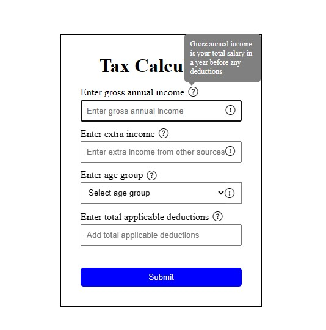

# Tax-Calculator

This tool helps you figure out how much money you'll have left after paying taxes. It takes into account your main income, any extra money you make, your age group, and any deductions you can claim.

# Deployed link

https://tax-calculator-swart.vercel.app/

# How it works

Input Your Income: First, you tell the calculator how much you earn in a year. This includes your salary from your job.
Extra Income: If you have any additional income from side gigs or investments, you can add that too.
Age Group: You select your age group. This helps determine the tax rules that apply to you.
Deductions: You can enter any tax deductions you're eligible for. This reduces the amount of income you're taxed on.
Submit: After filling in the details, you hit the submit button.

## References & Requirements

- The tax calculation works based on this formula -
  - Overall income (after deductions) under 8 (≤) Lakhs is not taxed.
    - Ex - if Gross Annual Income + Extra Income - Deductions = 6 Lakhs, no tax
    - if Gross Annual Income + Extra Income - Deductions = 9 Lakhs, tax
  - Income over 8 (>) Lakhs, the amount over 8 Lakhs is taxed at
    - 30% for people with age < 40
    - 40% for people with age ≥ 40 but < 60
    - 10% for people with age ≥ 60
    - Example
      - Age = 34, Income = 40 Lakhs, no deductions, tax = .3 _ (40 - 8) = .3 _ 32 = 9.6 Lakhs
- Do not restrict the user from entering incorrect values like characters in the number fields
  - Highlight an error icon to the right of the input field (shown as an example in the above image as a circle with `!`). Hovering over it should show the error in a tooltip
  - If no errors are present, don't show the error icon
  - This should be present in all the number fields
- The age dropdown field should have 3 values -
  - <40
  - ≥ 40 & < 60
  - ≥ 60
  - If the user has not entered this value and clicks on submit, show an error icon hovering over which should show that the input field is mandatory
- Error icons should not be visible in the form by default.
- Clicking on submit should show a modal which would show the final values based on the above calculations.

# Assumptions Considered:

Input Validation:

We've implemented thorough input validation to ensure accurate data processing:

    Validation Triggers: Input values are checked for validity when you focus on them, make changes, or click the submit button.

    Error Display:
        Negative Numbers: If you type a number less than zero, you'll see an error message reminding you to input non-negative numbers.
        Empty Fields: Leaving any field empty or not typing anything before submission triggers an error message indicating the field is mandatory.
        Non-Numeric Input: If you type anything other than a number, a message pops up asking you to input numbers only.

# Overall Income Calculation:

We've set up the calculation process to be intuitive:

    Income Threshold: If the combined total of gross income, extra income, and deductions doesn't exceed 8 lakhs, the overall income displayed will be the sum of your gross income and extra income.

These assumptions streamline the user experience, ensuring accurate data entry and clear understanding of the results.

Examples

(Screenshot 2024-04-15 002225.jpg)

(Screenshot 2024-04-15 001840.jpg)

# How to Run

Step 1 : Download the Code:

    Start by downloading the HTML, CSS, and JavaScript files to your computer. You can do this by clicking on the provided download link or by copying the code and saving it into separate files with the corresponding file extensions (.html, .css, .js).

Step 2 : Open HTML File:

    After downloading, locate the HTML file you've downloaded and open it in your preferred web browser. You can do this by double-clicking the HTML file or by right-clicking and selecting "Open with" and then choosing your web browser from the list.

Step 3 : Ensure Internet Connection:

    It's important to ensure that your computer is connected to the internet while running the application locally. This is because the application uses Bootstrap icons via CDN links. If you're offline, these icons may not appear.

Step 4 : Interact with the Application:

    Once the HTML file is open in your web browser, you can interact with the tax calculator just as you would on a live website. Input values into the fields, click the submit button, and observe how the calculations and error messages behave

